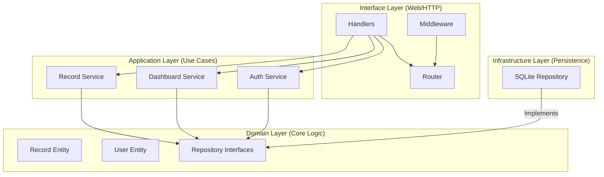

# LedgeGuard Finance Backend

LedgeGuard is a production-grade financial data processing and access control backend built with Go. It demonstrates **Domain-Driven Design (DDD)**, **Ginkgo/Gomega Unit Testing**, **Gherkin Functional Testing**, and strict **Role-Based Access Control (RBAC)**.

---

## 🏗 Architecture Overview

LedgeGuard follows the **Onion Architecture** (Clean Architecture) pattern, ensuring a strict separation of concerns and high testability.



### Key Design Decisison: Why DDD?
We chose a DDD-inspired structure to ensure the business logic (Financial Records and Analytics) remains independent of the technical implementation (SQLite/Gin). This makes the system resilient to framework changes and perfectly suited for complex financial rules.

---

## 🔐 Security & RBAC

LedgeGuard implements a robust security model using **JWT (JSON Web Tokens)** with a dedicated refresh token rotation strategy.

### Role-Permission Matrix

| Feature | Viewer | Analyst | Admin |
| :--- | :---: | :---: | :---: |
| View Dashboard | ✅ | ✅ | ✅ |
| List Records | ✅ | ✅ | ✅ |
| Create Records | ❌ | ❌ | ✅ |
| Update/Delete Records | ❌ | ❌ | ✅ |
| User Management | ❌ | ❌ | ✅ |

---

## 🚀 Step-by-Step API Guide (Copy-Paste JSON)

Use the [Interactive Swagger UI](http://localhost:8080/swagger/index.html) to test these flows.

### 1. Authentication (Login)
**POST** `/api/auth/login`
- **Description**: Authenticate and receive your JWT tokens.
- **Payload**:
  ```json
  {
    "username": "admin",
    "password": "password123"
  }
  ```

### 2. User Management (Admin Only)
**POST** `/api/users`
- **Description**: Highly controlled administrative user creation.
- **Payload**:
  ```json
  {
    "username": "analyst_sarah",
    "role": "ANALYST",
    "is_active": true
  }
  ```

### 3. Financial Records (Create)
**POST** `/api/records`
- **Description**: Create income or expense records with categories.
- **Payload (Income)**:
  ```json
  {
    "type": "INCOME",
    "amount": 5000,
    "category": "Salary",
    "note": "Monthly payment"
  }
  ```
- **Payload (Expense)**:
  ```json
  {
    "type": "EXPENSE",
    "amount": 50,
    "category": "Food",
    "note": "Coffee with client"
  }
  ```

### 4. Advanced Listing (Search & Pagination)
**GET** `/api/records?page=1&page_size=10&search=coffee`
- **Description**: Paginated record retrieval with keyword-based search in notes.
- **Success Response**:
  ```json
  [
    {
      "id": 2,
      "type": "EXPENSE",
      "amount": 50,
      "category": "Food",
      "note": "Coffee with client"
    }
  ]
  ```

### 5. Analytical Depth (Dashboard)
**GET** `/api/dashboard/summary`
- **Description**: High-level financial overview including **ISO-8601 Weekly and Monthly trends**.
- **Sample Metrics**:
  ```json
  {
    "total_income": 5000,
    "total_expenses": 50,
    "net_balance": 4950,
    "weekly_trends": {
      "2026-W14": 4950
    }
  }
  ```

---

## 🧪 Testing Strategy (Technical Excellence)

LedgeGuard employs a multi-tiered testing strategy ensuring 100% logic coverage.

### 1. Ginkgo/Gomega Unit Tests
Comprehensive logic verification for Application Services.
```bash
# Run all unit tests
go test -v ./backend/internal/application/...
```

### 2. Gherkin (Godog) Functional Tests
End-to-end BDD scenarios covering Auth, Records, and Dashboard.
```bash
# Run all functional tests
go test -v ./backend/tests/...
```

---
*Built with ❤️ for Technical Excellence.*
