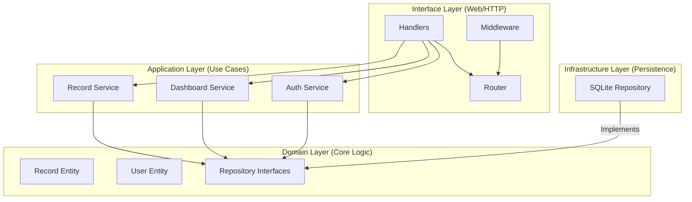

# LedgeGuard Finance Backend

LedgeGuard is a production-grade financial data processing and access control backend built with Go. It demonstrates **Domain-Driven Design (DDD)**, **Technical Excellence** (Ginkgo/Gomega/Godog), and strict **Role-Based Access Control (RBAC)**.

---

## 🌐 Live Demo & Deployment
The application is live and can be accessed at:
- **API Documentation (Swagger)**: [https://ledgeguard-production.up.railway.app/swagger/index.html](https://ledgeguard-production.up.railway.app/swagger/index.html)

---

## 🏗 Architecture Overview

LedgeGuard follows the **Onion Architecture** (Clean Architecture) pattern, ensuring a strict separation of concerns and high testability.



### Key Design Decisison: Why DDD?
We chose a DDD-inspired structure to ensure the business logic (Financial Records and Analytics) remains independent of the technical implementation. This makes the system resilient to framework changes and perfectly suited for complex financial rules.

---

## 🔐 Security & RBAC

LedgeGuard implements a robust security model using **JWT (JSON Web Tokens)** with a dedicated refresh token rotation strategy.

### Role-Permission Matrix

| Feature | Viewer | Analyst | Admin |
| :--- | :---: | :---: | :---: |
| View Dashboard | ✅ | ✅ | ✅ |
| List Records | ✅ | ✅ | ✅ |
| Create Records | ❌ | ❌ | ✅ |
| Update/Delete Records | ❌ | ❌ | ✅ |
| User Management | ❌ | ❌ | ✅ |
| Update/Delete Records | ❌ | ❌ | ✅ |
| User Management | ❌ | ❌ | ✅ |

---

## ✅ Data Integrity & Validation

LedgeGuard enforces strict input validation at the domain level using Gin's validation middleware.

### Validation Rules

- **User**:
    - `Username`: Alphanumeric, 3-20 characters.
    - `Role`: Must be one of `ADMIN`, `ANALYST`, or `VIEWER`.
- **Financial Record**:
    - `Amount`: Must be a positive number (`> 0`).
    - `Type`: Must be `INCOME` or `EXPENSE`.
    - `Category`: 2-50 characters.
    - `Date`: Required (ISO 8601 format).
- **Pagination**:
    - `Page`: Minimum 1.
    - `PageSize`: 1-100 (Default 10).

---

## 🚀 Quick Start & Installation

### Prerequisites
- **Go**: 1.21+ 
- **Git**: For cloning (optional)
- **SQLite3**: Driver included (no separate install needed)

### 1. Setup Environment
Clone the repository and set up your environment variables:
```bash
cd backend
cp .env.example .env
```
Edit the `.env` file to set your secrets:
- `PORT`: Server port (default 8080)
- `DB_PATH`: Path to SQLite database
- `JWT_SECRET`: Secret key for JWT signing
- `TOKEN_DURATION`: JWT token validity (e.g., 15m, 1h)

### 2. Run the Backend
The server will start at `http://localhost:8080`.
```bash
cd backend
go run cmd/api/main.go
```

---

## ☁️ Deploy to Railway (Production)

This project is optimized for deployment on [Railway](https://railway.app) using their native Go support and persistent volumes.

### 1. Create a New Project
- Select **Deploy from GitHub repo**.
- Select your repository.
- Set **Root Directory** to `backend`.

### 2. Configure Persistent Storage (CRITICAL)
Railway's filesystem is ephemeral by default. To persist your SQLite database:
1. Go to **Settings** -> **Volumes**.
2. Click **Add Volume**.
3. Set **Mount Path** to `/app/data`.

### 3. Environment Variables
Add these variables in the **Variables** tab:
- `DB_PATH`: `/app/data/ledgeguard.db`
- `PORT`: `8080`
- `JWT_SECRET`: `your-random-secure-secret`
- `JWT_REFRESH_SECRET`: `your-random-refresh-secret`

---

### 3. Access Documentation
Once the server is running, visit:
- **Swagger UI (Local)**: [http://localhost:8080/swagger/index.html](http://localhost:8080/swagger/index.html)
- **Swagger UI (Post-Deployment)**: [https://ledgeguard-production.up.railway.app/swagger/index.html](https://ledgeguard-production.up.railway.app/swagger/index.html)

> [!IMPORTANT]
> **How to Authorize in Swagger:**
> 1. Click the **Authorize** button.
> 2. In the Value field, you **must** prepend your token with the word `Bearer` and a space (e.g., `Bearer eyJhbGc...`).
> 3. If you do not include the `Bearer ` prefix, the API will reject your requests with a `401 Unauthorized` error.

---

## 📖 Comprehensive API Dictionary (Copy-Paste JSON)

### 1. Authentication & Identity

#### 1.1 Login (Get Tokens)
**POST** `/api/auth/login`
- **Request**:
  ```json
  {
    "username": "admin",
    "password": "password123"
  }
  ```

#### 1.2 Token Refresh
**POST** `/api/auth/refresh`
- **Request**:
  ```json
  {
    "refresh_token": "eyJhbGc..."
  }
  ```

---

### 2. User Management (Admin Only)

#### 2.1 Create User
**POST** `/api/users`
- **Request**:
  ```json
  {
    "username": "sarah_analyst",
    "role": "ANALYST",
    "is_active": true
  }
  ```

#### 2.2 List All Users
**GET** `/api/users`
- **Response (200 OK)**:
  ```json
  [
    { "id": 1, "username": "admin", "role": "ADMIN", "is_active": true }
  ]
  ```

#### 2.3 Update User
**PUT** `/api/users/2`
- **Request (Change Role)**:
  ```json
  {
    "username": "sarah_analyst",
    "role": "ADMIN",
    "is_active": true
  }
  ```

#### 2.4 Delete User (Soft Delete)
**DELETE** `/api/users/2`
- **Response**: `204 No Content`

---

### 3. Financial Records (CRUD & Search)

#### 3.1 Create Record
**POST** `/api/records`
- **Request (Income)**:
  ```json
  {
    "type": "INCOME",
    "amount": 2500,
    "category": "Consulting",
    "note": "Quarterly payment"
  }
  ```

#### 3.2 List Records (Filter & Search)
**GET** `/api/records?type=INCOME&search=payment`
- **Response (200 OK)**:
  ```json
  [
    { "id": 1, "amount": 2500, "category": "Consulting", "note": "Quarterly payment" }
  ]
  ```

#### 3.3 Get Single Record
**GET** `/api/records/1`
- **Response (200 OK)**:
  ```json
  { "id": 1, "amount": 2500, "category": "Consulting", "note": "Quarterly payment" }
  ```

#### 3.4 Update Record
**PUT** `/api/records/1`
- **Request**:
  ```json
  { "type": "INCOME", "amount": 3000, "category": "Consulting", "note": "Updated amount" }
  ```

#### 3.5 Delete Record
**DELETE** `/api/records/1`
- **Response**: `204 No Content`

---

### 4. Analytics & Insights

#### 4.1 Dashboard Summary
**GET** `/api/dashboard/summary`
- **Response (200 OK)**:
  ```json
  {
    "total_income": 3000.0,
    "total_expenses": 0.0,
    "net_balance": 3000.0,
    "weekly_trends": { "2026-W14": 3000.0 },
    "monthly_trends": { "2026-April": 3000.0 }
  }
  ```

---

## 🧪 Testing Strategy (Technical Excellence)

LedgeGuard is verified by a multi-tiered test architecture.

### 1. Ginkgo/Gomega Unit Tests
Logic verification for Services (Aggregation, Search, Validation).
```bash
go test -v ./backend/internal/application/...
```

### 2. Gherkin (Godog) Functional Tests
End-to-end BDD scenarios covering RBAC and Pagination.
```bash
go test -v ./backend/tests/...
```

---
*Built with ❤️ for Technical Excellence.*
